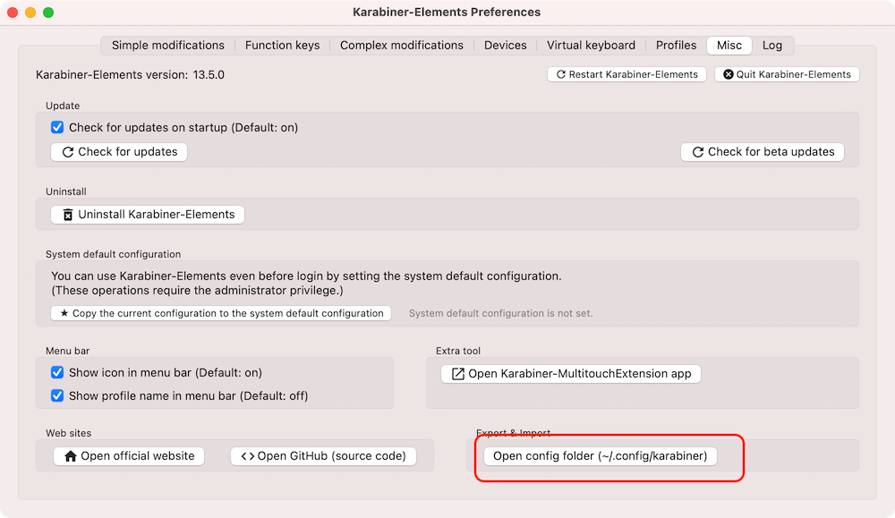
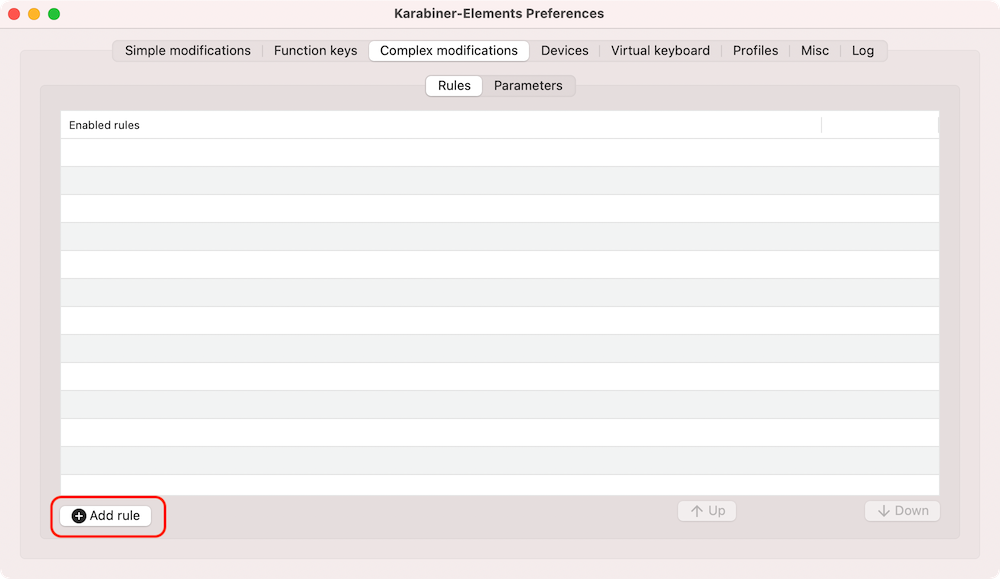
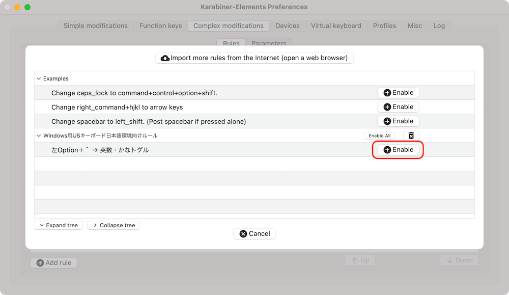

# Karabiner-ElementsのWindows用USキーボード日本語環境向けルール

## 機能
  -  左Option＋｀(グレイヴ・アクセント)で日本語のトグル切替を実施。

## 前提条件

  - Karabiner-Elementsが動作していること。

## 利用方法

  * Karabiner-Elementsでconfigフォルダを開く。
  
    
  * assets/complex_modificationsフォルダに移動し、このリポジトリのkarabina_windows_us.jsonを設置する。
  * Karabiner-Elementsを再起動する。

    
  * ルールを有効化する。

    
    